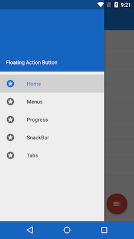
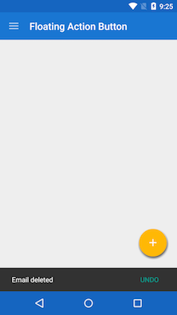
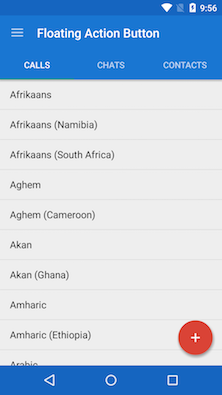

# Floating Action Button for Xamarin.Android

This is a Java Library binding for the [Clans FloatingActionButton](https://github.com/Clans/FloatingActionButton)  version **1.6.4**. I've also ported the Android sample project to show some of the features in action.

### Installation
To add this binding to your Xamarin.Android project [use the NuGet package](https://www.nuget.org/packages/FAB.XamarinAndroid/) :

    PM> Install-Package FAB.XamarinAndroid

### Requirements
The library requires Android **API Level 14+**.

## Screenshots
          

## Credits
Dmitry Tarianyk for create its library [FloatingActionButton](https://github.com/Clans/FloatingActionButton).
